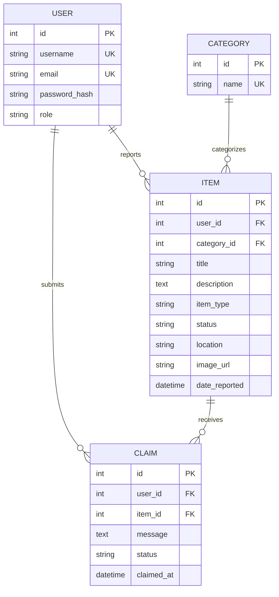

# 🌐 Campus Lost and Found Management System

A full-stack web application built to help students, staff, and administrators report lost and found items in one centralized place. The system replaces informal channels such as notice boards, WhatsApp groups, and word of mouth with a reliable digital platform for reporting, searching, adding image URLs, and submitting claims.

This project is a practical example of a modern Flask + React application with authentication, database modeling, migrations, and API-based communication.

---

## 🗂 Table of Contents

1. [Project Overview](#-project-overview)
2. [Problem Statement](#-problem-statement)
3. [Solution](#-solution)
4. [Features](#-features)
5. [Tech Stack](#-tech-stack)
6. [Project Structure](#-project-structure)
7. [Database Design](#-database-design)
8. [Authentication](#-authentication)
9. [API Overview](#-api-overview)
10. [Installation](#-installation)
11. [Environment Variables](#-environment-variables)
12. [Migrations](#-migrations)
13. [Deployment](#-deployment)
14. [Contributing](#-contributing)
15. [License](#-license)

---

## 🎯 Project Overview

The Campus Lost and Found Management System is designed to solve a real university problem: belongings are often misplaced on campus and recovered without a structured process for returning them to their owners.

The system allows users to:

- register and log in securely
- create lost item reports
- create found item reports
- add image URLs to items
- search and filter listings
- submit ownership claims
- track claim status

---

## 🚨 Problem Statement

Many institutions still rely on manual and informal methods to manage lost property. These methods are often:

- slow
- hard to search
- difficult to verify
- easy to misuse
- inefficient for large communities

This leads to delayed recoveries and unnecessary frustration for students and staff.

---

## ✅ Solution

The platform provides a centralized digital workflow for handling lost and found items. It improves organization, accountability, and the chances of returning property to the rightful owner.

The app supports:

- user accounts and authentication
- category-based item reporting
- claim submission and review
- item status tracking

---

## ✨ Features

### Authentication

- user registration
- login with JWT-based authentication
- protected routes for authenticated users

### Item Management

- report lost items
- report found items
- add descriptions, location, and category
- track status such as Pending, Claimed, and Returned

### Claims

- submit ownership claims
- review claim status
- manage claim history

### User Experience

- responsive frontend interface
- search and filtering support
- organized listing of reports

---

## 🛠️ Tech Stack

### Frontend

- React
- Vite
- React Router
- JavaScript / JSX

### Backend

- Flask
- Flask-SQLAlchemy
- Flask-Migrate
- Flask-Marshmallow
- Flask-JWT-Extended
- Flask-Bcrypt
- Flask-CORS

### Database

- SQLite for local development
- PostgreSQL can be used for production deployment

### Tools

- Git and GitHub
- VS Code
- Postman

---

## 📁 Project Structure

```text
Campus lost and found/
├── app.py
├── extensions.py
├── Pipfile
├── README.md
├── seed.py
├── .gitignore
├── controllers/
│   ├── __init__.py
│   ├── auth_controller.py
│   ├── category_controller.py
│   ├── claim_controller.py
│   ├── item_controller.py
│   └── user_controller.py
├── models/
│   ├── __init__.py
│   ├── user.py
│   ├── category.py
│   ├── item.py
│   └── claim.py
├── schemas/
│   ├── __init__.py
│   ├── user_schema.py
│   ├── category_schema.py
│   ├── item_schema.py
│   └── claim_schema.py
├── migrations/
│   ├── alembic.ini
│   ├── env.py
│   ├── README
│   ├── script.py.mako
│   └── versions/
├── instance/
└── client/
    ├── .gitignore
    ├── eslint.config.js
    ├── index.html
    ├── package.json
    ├── package-lock.json
    ├── vite.config.js
    ├── README.md
    ├── public/
    └── src/
        ├── main.jsx
        ├── App.jsx
        ├── index.css
        └── assets/
```

---

## 🗄️ Database Design

The application uses a relational database model with the following relationships:

- One-to-Many: User to Item
- One-to-Many: Category to Item
- One-to-Many: User to Claim
- One-to-Many: Item to Claim

### Main Models

| Model | Purpose |
| --- | --- |
| User | stores account credentials and role |
| Category | classifies items into categories |
| Item | stores the main lost/found record |
| Claim | records claims made by users for items |

### ER Diagram



---

## 🔐 Authentication

Authentication is handled with JWT.

### Flow

1. A user registers an account.
2. The server verifies credentials during login.
3. A JWT token is issued.
4. The client sends the token in the Authorization header.
5. Protected routes validate the token before access is granted.

Example header:

```http
Authorization: Bearer <access_token>
```

---

## 📡 API Overview

The backend exposes endpoints for authentication, users, items, categories, and claims.

| Method | Endpoint | Description |
| --- | --- | --- |
| POST | /register | register a new user |
| POST | /login | authenticate a user and return a token |
| GET | /items | list all items |
| POST | /items | create a new item report |
| GET | /items/<id> | retrieve one item |
| PUT | /items/<id> | update an item |
| DELETE | /items/<id> | delete an item |
| GET | /categories | list categories |
| POST | /claims | submit a claim |

Example request:

```bash
curl -X POST http://127.0.0.1:5000/register \
  -H "Content-Type: application/json" \
  -d '{"username":"student","email":"student@example.com","password":"secure123"}'
```

---

## 🚀 Installation

### 1. Clone the repository

```bash
git clone <repo-url>
cd "Campus lost and found"
```

### 2. Create and activate a virtual environment

```bash
pipenv shell
```

### 3. Install dependencies

```bash
pipenv install
```

### 4. Run the backend

```bash
python main.py
```

### 5. Run the frontend

```bash
cd client
npm install
npm run dev
```

---

## ⚙️ Environment Variables

Create a .env file if needed for production configuration.

```env
SECRET_KEY=your_secret_key
JWT_SECRET_KEY=your_jwt_secret_key
DATABASE_URL=sqlite:///campus_lost_found.db
UPLOAD_FOLDER=uploads
MAX_CONTENT_LENGTH=16777216
```

---

## 🧪 Migrations

Database migrations are managed with Flask-Migrate.

Common commands:

```bash
flask db init
flask db migrate -m "initial migration"
flask db upgrade
flask db downgrade
```

---

## 🚢 Deployment

### Frontend

The React client can be deployed to Vercel or a similar hosting platform.

### Backend

The Flask API can be deployed to Render or another Python-friendly hosting service.

### Database

Use PostgreSQL in production for reliability and scalability.

---

## 🤝 Contributing

Contributions are welcome.

1. Fork the repository.
2. Create a feature branch.
3. Make your changes.
4. Test your changes.
5. Submit a pull request.

---

## 📄 License

This project is licensed under the MIT License.
